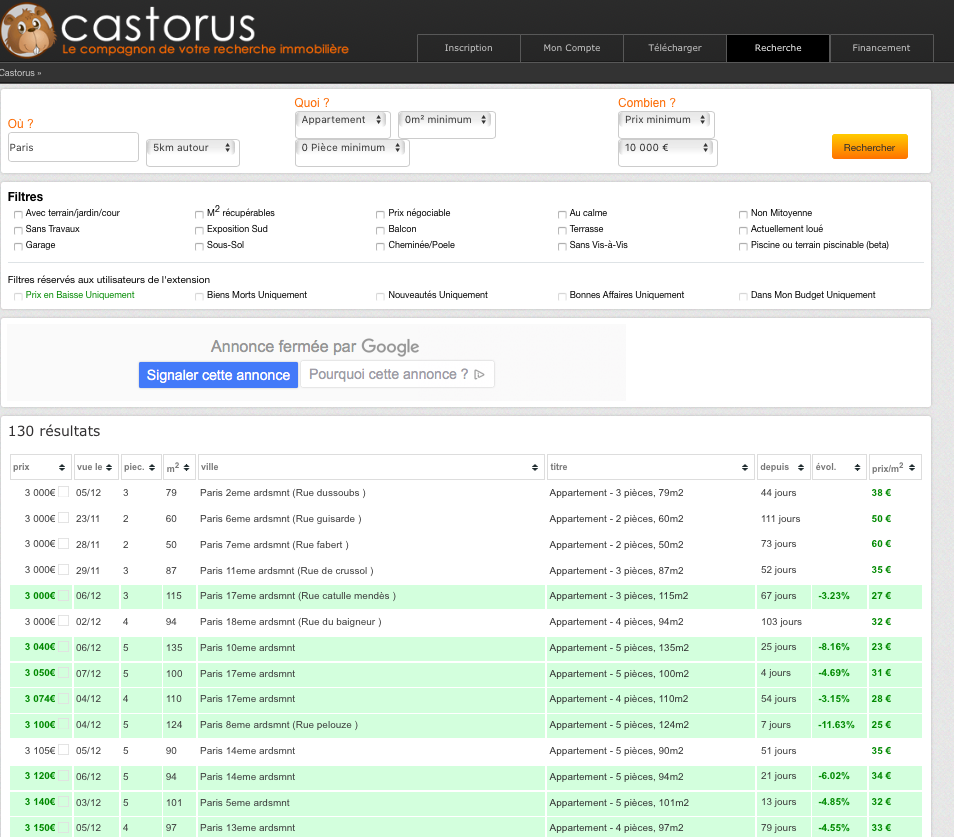
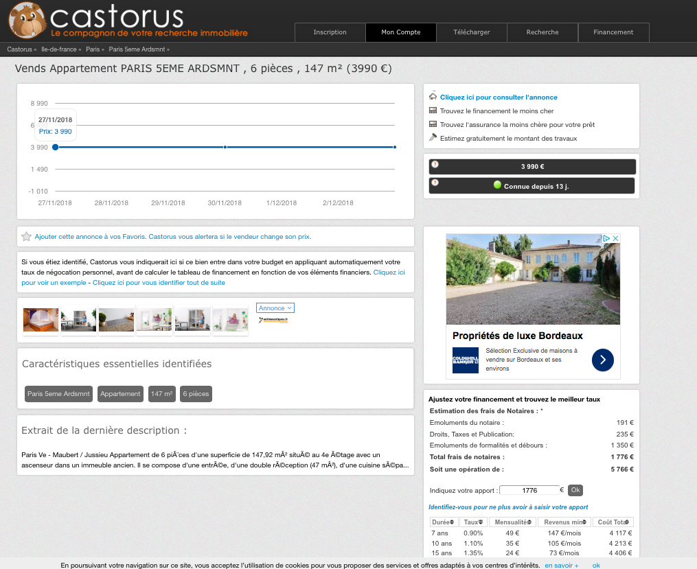

```{r setup, include = FALSE}
knitr::opts_chunk$set(
  collapse = TRUE,
  comment = "#>"
)
```

```{r include = FALSE}
library(dplyr)
library(rvest)
library(knitr)
library(apartment.paris)
library(purrr)
library(data.table)
library(tidyr)
library(stringr)
```


Castorus is an extension from Firefox or Chrome that compile apartments ads from different websites. It also enables you to have history of the ads. 

We decided to focus only on apartments to buy 5km around Paris. The problem is that only 500 ads appear and there are pages index to access to all the other adds. Thus we decided to divide all the ads by range price. Thus we only search for apartments between 0 and €10,000 and then €10,001 and €20,000 and so on and so forth until €3,000,000. We extracted the tables from all this pages. 

Note : To understand the url : "https://www.castorus.com/s/Paris,51185,2-1----10000"  
- the first two refers to the fact that it is an apartment  
- the following 1 refers to the fact that is it 5km around Paris 
- the last number (10000) refers to the maximum price 



To exract the table from one particular page, we use `get_table(url)`

```{r}
url <- "https://www.castorus.com/s/Paris,51185,2-1----10000"
kable(head(get_table(url)), caption = "Dataframe created from a table on a HTML page")
```

Then, the descriptions of the apartments are not available in this table. To have access to the descriptions of the ads, you have to click on the `titre` column of the ads. Thus we have to extract all the page links containing those descriptions. This is the goal of the `get_link(url)`function. 

```{r}
url <- "https://www.castorus.com/s/Paris,51185,2-1----10000"
kable(head(get_link(url)), caption = "")
```



Now we just have ton extract the text descriptions from each description page : `get_description(url)` function. 

```{r}
url <- "https://www.castorus.com/paris-5eme-ardsmnt,d63055365"
kable(get_description(url))
```

All the functions created above apply only on a particular webpage. We know have to create a global dataframe with all the ads from different webpages thanks to the function `get_dataframe(list_url)`

```{r}
list_url <- list("https://www.castorus.com/s/Paris,51185,2-1----10000", "https://www.castorus.com/s/Paris,51185,2-1---10001-20000")
kable(head(get_dataframe(list_url)))

#True list 
# base_url <- "https://www.castorus.com/s/Paris,51185,2-2---"
#list_url <- paste0(base_url,seq(0, 2990000, by = 10000),"-", seq(9900, 3000000, by = 10000)))
```

Then we will clean this dataframe to make it easier for further analysis : 
- divide into two different columns the city (`ville`) and the street (`rue`)  
- clean the price variable: remove the euro sign (€), the space between thousands and hundreds (3 000 -> 3000), the 0 before non-zero numbers (03 -> 3)  
- we have to remove the apartments that are only for rent. So we keep only studios (1 room) no matter their price and keep the apartments that have at least 2 rooms with a price higher than €50,000  
- keep only apartments to sell in Paris and divide into two different columns the city (`ville`) and the neighbourhood (`arrondissement`) and keep only the number of the `arrondissement`

```{r}
list_url <- list("https://www.castorus.com/s/Paris,51185,2-1----10000", "https://www.castorus.com/s/Paris,51185,2-1---10001-20000")
castorus_data <- get_dataframe(list_url)
kable(head(clean_dataframe(castorus_data)))
```


