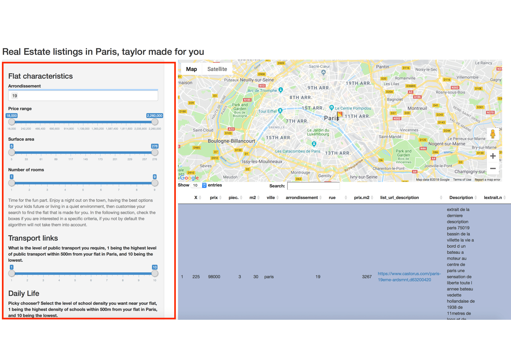
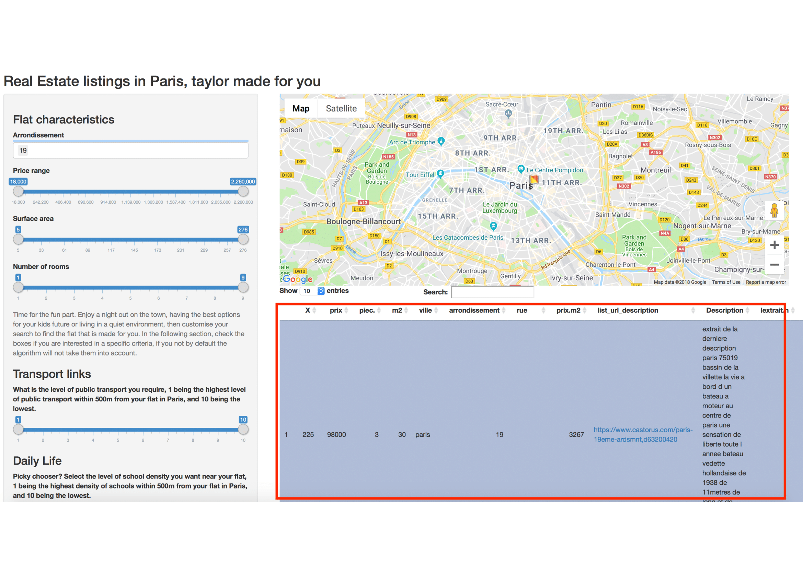

```{r setup, include = FALSE}
knitr::opts_chunk$set(
  collapse = TRUE,
  comment = "#>"
)
```

## Overview:

This function is used in order for the user to find his optimal dream flat inside of Paris. It is the user friendly app used to implement the functions which were defined in the apartment.paris R package. Therefore, the user will use the shiny app to input his own preferences for the code, which will automatically update every time he interacts with the command panel. An app is outputted in order to visualise the location in Paris of the flats which best fit criteria which have been selected. Finally, a table is outputted with all the characteristics of the flats which fit the users needs, and a clickable link to their webpage descriptions. All of the values used in the shiny were used from dataframes which were scrapped and cleaned on the web. 

## The Command input section:

The user input section is displayed on the left hand side of the screen. There are 2 major sections, the flat characterestics and its surroundings charecteristic.

The flats characteristics, consists in 4 choices:

- Price: A slider which will filter out all of the flats with prices lower or high than the values inputted by the user.

- Surface: A slider which will filter out all of the flats with surfaces lower or high than the values inputted by the user.

- Number of rooms: A slider which will filter out all of the flats with a number of rooms lower or high than the values inputted by the user.

- Arrondissement: The user will select the arrondissement in which he wants to live in.

The flat surroundings chartacteristics, consist of multiple choices:

- Transport links: The user will choose how much public transportation he needs in his flats surroundings, within 500m.  

- School density, the user has to choose in which percentile of school density of schools within 500m of flats he wants his flat to be.

- Commerce density, the user has to select how if he wants his flat to be in the densest parts of paris or not. Commerce in the data include bakeries, butchers, supermarkets, etc.

- Restaurant and cinema density, the user is asked if he wants to live in one of the most busy neighboorhoods of paris, in terms of number of restaurants and cinemas in the 500m adjacent to the flat.



## Ouput Section: 

Here the output section is divided into 2 different sections. A table where the user can see the flats which correspond to his criteria, and all of the characteristics of that flat. He can also select a hpyerlink which will give him access to webpage with that flat's description. He can also click the rows for the flats he is interested in and that will show the location with a flag symbol on the map above. 




